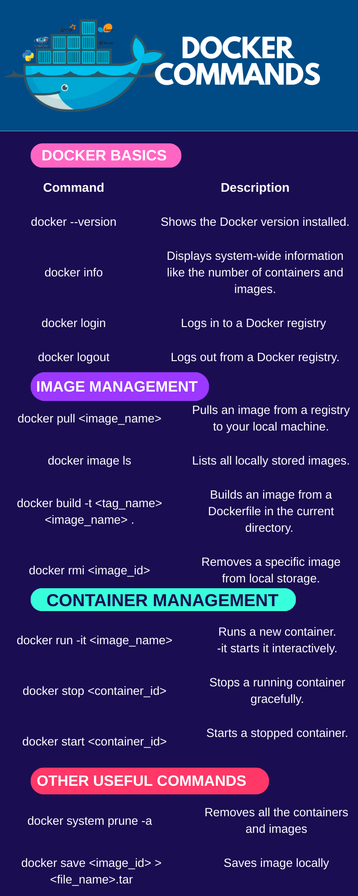

# 🐳 Docker Basics Cheatsheet

This repository provides a **quick reference guide** for the most commonly used Docker commands. 

It covers **Docker basics**, **image management**, **container management**, **Docker Compose**, and **other useful commands** for day-to-day usage.

It is designed for **searchability, copy-paste, and future expansion**.

## 📖 More commands in the Markdown
👉 [cheatsheet.md](./cheatsheet.md)
